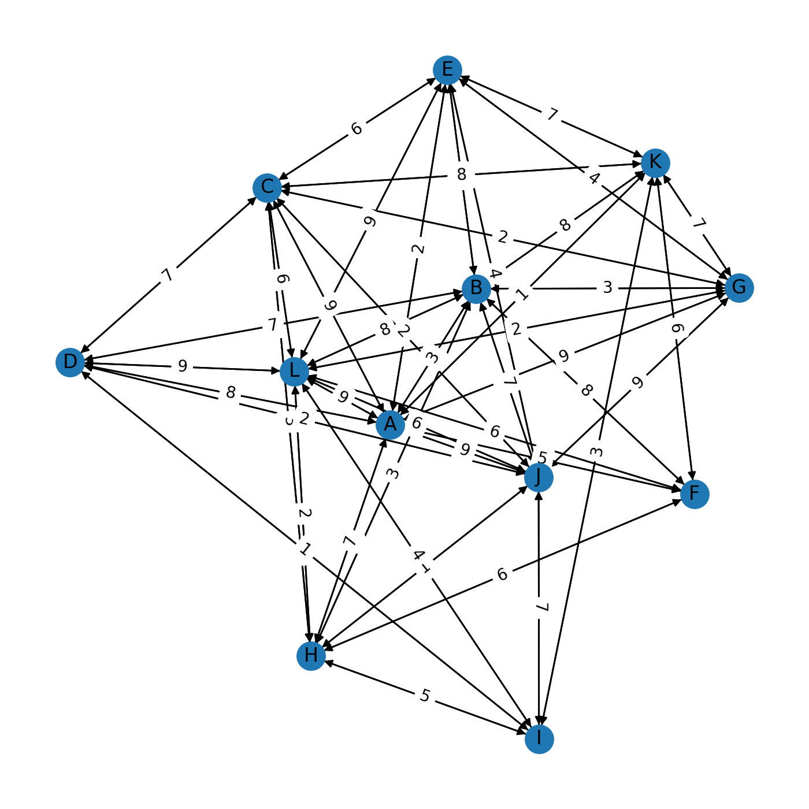

# DIJKSTRA PATH SEARCH

Basic programm to  get the shortest path between 2 vertexes in a graph. The aim of this project is to build a complete python package.


## INSTALLATION

Still working to create virtual envs. Problems with matplotlib.
Error message:
>ImportError: DLL load failed while importing ft2font: The specified procedure could not be found.


## USAGE

### Input:
```Python
n_vertex = 5            #Number of vertexes/nodes
max_dist = 10           #Max distance of edge
density = 10            #The bigger the less dense is the graph
seed = 3                #Random seed for graph generation
input_from_k = True     #start/end node defined by keyboard input
start = "A"
end = "B"
```

## Random Graph generation
A random graph is generated using input data. Randomness is guaranteed using max_dist and density parameters

```Python
distance = random.choice([i for i in range(0, max_dist)] +
                         [0 for i in range(0, density)])
```
if distance between 2 nodes i zero no edge will be created. So the weight between max_distance and density creates different outputs.
<p>

<em>example of 2 types of graphs</em>


